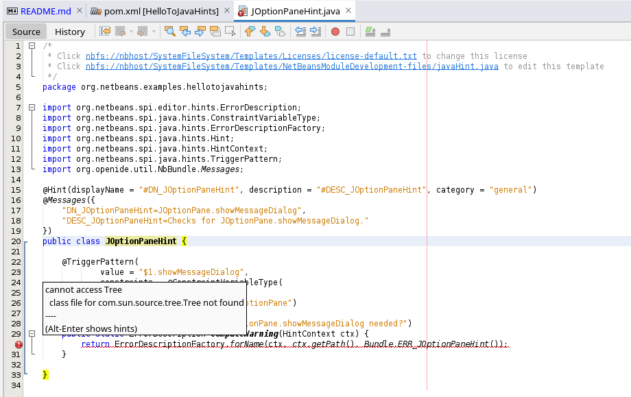

# HelloToJavaHints

This is a demonstrational project, just to create some dummy project producing a Java Hint within NetBeans and to check whether it is working, and especially to check test class execution.

## Available Tutorials
1. https://netbeans.apache.org/tutorials/70/nbm-java-hint.html
2. https://netbeans.apache.org/tutorials/71/nbm-java-hint.html
3. https://netbeans.apache.org/tutorials/80/nbm-java-hint.html
4. https://netbeans.apache.org/jackpot/HintsFileFormat.html

## Implementation

### Parameters

The Java Hint is created using the first part of tutorial [3] using the following parameters:

<table>
  <tr>
    <td>Artifact</td>
    <td>HelloToJavaHints</td>
  </tr>
  <tr>
    <td>Package</td>
    <td>org.netbeans.examples.hellotojavahints</td>
  </tr>
  <tr>
    <td>Hint Display Name</td>
    <td>JOptionPane.showMessageDialog</td>
  </tr>
  <tr>
    <td>Hint Description</td>
    <td>Checks for JOptionPane.showMessageDialog.</td>
  </tr>
  <tr>
    <td>Warning Message</td>
    <td>Is JOptionPane.showMessageDialog needed?</td>
  </tr>
  <tr>
    <td>Automatic Fix</td>
    <td>None</td>
  </tr>
  <tr>
    <td>Class Name</td>
    <td>JOptionPaneHint</td>
  </tr>
</table>

### TriggerPattern Replacement

    @TriggerPattern(
            value = "$1.showMessageDialog",
            constraints = @ConstraintVariableType(
                    variable = "$1",
                    type = "javax.swing.JOptionPane")
    )

## Source Code and Results

The source code has been created using NetBeans 13 running JDK 8 on Arch Linux.

